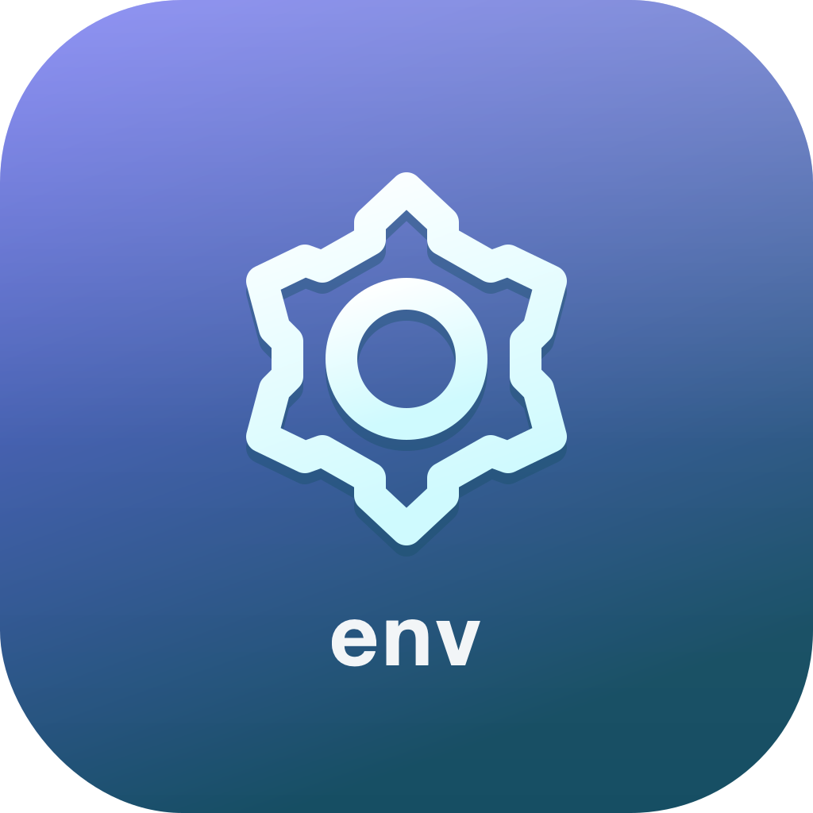
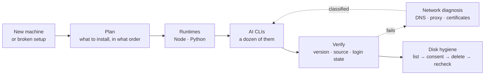

<div align="center">



# SOIA Open Env Skills

**The most misleading state an AI tool can be in: the command runs, but it isn't usable**

18 skills that install it, verify it, and diagnose it. Read-only diagnosis; destructive actions need your authorization

[中文](README.md) · English · [Ecosystem portal](https://github.com/soia-team/soia-open-skills)

<p align="center">
  
  
  
  
  
</p>

</div>

---

## What it solves

`node -v` printing a version does not mean the environment works; an app file existing does not mean login finished. Setting up a new machine fails differently every time, but **always at the "I thought it was installed" step**.



## 18 skills

### 01 Planning and verification　`A new machine → a verified, working AI environment`

| Skill | Responsibility | Ready |
|---|---|:-:|
| [`soia-env-environment-setup`](https://github.com/soia-team/soia-open-skills/blob/main/docs/skills/soia-env-environment-setup.md) | Plans and verifies a development environment from scratch, coordinating the install skills it needs | ✅ |
| [`soia-env-open-skills-install`](https://github.com/soia-team/soia-open-skills/blob/main/docs/skills/soia-env-open-skills-install.md) | Installs or updates SOIA open skills across the three hosts, at full, per-plugin or per-host scope | ✅ |
| [`soia-env-ai-cli-upgrade`](https://github.com/soia-team/soia-open-skills/blob/main/docs/skills/soia-env-ai-cli-upgrade.md) | Audits and upgrades several AI CLIs under authorization, dry-running first and verifying after | ✅ |
| [`soia-env-network-diagnose`](https://github.com/soia-team/soia-open-skills/blob/main/docs/skills/soia-env-network-diagnose.md) | Read-only diagnosis of DNS, HTTPS, proxy, certificates and official sources, plus a categorized local runtime inventory that derives which AI CLIs this machine can install, reported in a fixed seven-column table | ✅ |
| [`soia-env-storage-cleanup`](https://github.com/soia-team/soia-open-skills/blob/main/docs/skills/soia-env-storage-cleanup.md) | Measures managed config, state and cache usage and produces a list; deletes only after consent, then rechecks | ✅ |

### 02 Runtimes　`Empty machine → working Node and Python`

| Skill | Responsibility | Ready |
|---|---|:-:|
| [`soia-env-node-install`](https://github.com/soia-team/soia-open-skills/blob/main/docs/skills/soia-env-node-install.md) | Installs, verifies or updates Node.js and npm under authorization | ✅ |
| [`soia-env-python-install`](https://github.com/soia-team/soia-open-skills/blob/main/docs/skills/soia-env-python-install.md) | Installs, verifies or updates Python and pip under authorization | ✅ |

### 03 AI CLIs　`command not found → installed, logged in, version confirmed`

| Skill | Responsibility | Ready |
|---|---|:-:|
| [`soia-env-claude-cli-install`](https://github.com/soia-team/soia-open-skills/blob/main/docs/skills/soia-env-claude-cli-install.md) | Anthropic Claude Code CLI install, login and authorized update | ✅ |
| [`soia-env-codex-install`](https://github.com/soia-team/soia-open-skills/blob/main/docs/skills/soia-env-codex-install.md) | OpenAI Codex CLI install, verification and authorized update | ✅ |
| [`soia-env-codex-setup-support`](https://github.com/soia-team/soia-open-skills/blob/main/docs/skills/soia-env-codex-setup-support.md) | Diagnoses Codex desktop and CLI install, login, performance and storage issues | ✅ |
| [`soia-env-kimi-cli-install`](https://github.com/soia-team/soia-open-skills/blob/main/docs/skills/soia-env-kimi-cli-install.md) | Moonshot Kimi Code CLI; distinguishes the official standalone install from the npm one | ✅ |
| [`soia-env-opencode-cli-install`](https://github.com/soia-team/soia-open-skills/blob/main/docs/skills/soia-env-opencode-cli-install.md) | OpenCode CLI install, login and configuration | ✅ |
| [`soia-env-antigravity-cli-install`](https://github.com/soia-team/soia-open-skills/blob/main/docs/skills/soia-env-antigravity-cli-install.md) | Google Antigravity CLI (`agy`) install, login and migration from Gemini CLI | ✅ |
| [`soia-env-deepcode-cli-install`](https://github.com/soia-team/soia-open-skills/blob/main/docs/skills/soia-env-deepcode-cli-install.md) | Open-source Deep Code Agent CLI install and configuration | ✅ |
| [`soia-env-pi-cli-install`](https://github.com/soia-team/soia-open-skills/blob/main/docs/skills/soia-env-pi-cli-install.md) | Pi (pi-coding-agent) CLI install and configuration | ✅ |
| [`soia-env-qoder-cli-install`](https://github.com/soia-team/soia-open-skills/blob/main/docs/skills/soia-env-qoder-cli-install.md) | Qoder CLI; distinguishes official standalone, Homebrew and npm sources | ✅ |

### 04 Desktop clients　`Download page → installed, signature verified, launches`

| Skill | Responsibility | Ready |
|---|---|:-:|
| [`soia-env-workbuddy-install`](https://github.com/soia-team/soia-open-skills/blob/main/docs/skills/soia-env-workbuddy-install.md) | WorkBuddy desktop install, signature verification and authorized update | ✅ |

### 05 Local models　`Bare machine → engine chosen, quality and throughput measured, comparable report`

| Skill | Responsibility | Ready |
|---|---|:-:|
| [`soia-env-local-model-bench`](https://github.com/soia-team/soia-open-skills/blob/main/docs/skills/soia-env-local-model-bench.md) | Local LLM benchmarking on Apple Silicon: starts with environment check and engine selection, downloads only after confirmation; question-bank judging, throughput/TTFT and hardware profiling with a fixed reporting contract | ✅ |

✅ All 18 skills work right after install — no API key needed. Logins and system prompts are completed by you in each official interface

## Install

Any of three hosts. Installing the domain plugin brings all 18 skills at once.

```bash
claude plugin marketplace add soia-team/soia-open-skills && claude plugin install soia-env@soia
```

```bash
codex plugin marketplace add soia-team/soia-open-skills && codex plugin add soia-env@soia
```

WorkBuddy is a desktop app with no CLI, so a skill does the work — tell your agent "install into WorkBuddy", or run:

```bash
python3 <soia-open-skills>/skills/soia-meta-skill-release/scripts/install_workbuddy_experts.py soia-env
```

Restart the client, then summon **Soia · 环境安装工程师** under Experts → My Experts.

> **Always-on cost ~1.5k tok**. Once the machine is set up, `claude plugin disable soia-env@soia` puts it away until the next one.
> For a single skill use npx: `npx skills add soia-team/soia-open-env-skills -g -a '*' -s <skill-name> -y` — pick one route or the other; running both puts the same skill in the index twice and the copies drift apart.

## What it does not do

- **Does not log in for you.** Accounts, verification codes and system security prompts are completed by you in the official interface; the skills never handle your password.
- **Does not migrate credentials.** A plaintext API key gets its location reported and a Keychain or environment-variable suggestion — nothing is moved for you.
- **Cleanup requires consent first.** Deletion happens only after you have seen the current list and agreed; there is no unattended full-disk cleanup.
- **Does not install third-party ports.** When the official page has no download for your platform, it reports "platform unverified".
- **Does not treat desktop apps as npm packages.** Clients like WorkBuddy go through their official update path only.

## More

| Looking for | Where |
|---|---|
| Why first-run configuration ≠ finished install, frequent-skill quick reference, repo layout, three-repo collaboration, permission and storage boundaries, official sources | [docs/operations.md](docs/operations.md) |
| Which domains to install per machine purpose | [install-profiles.md](https://github.com/soia-team/soia-open-skills/blob/main/docs/install-profiles.md) |
| How the whole ecosystem works | [Learning guide](https://github.com/soia-team/soia-open-skills/blob/main/docs/learning-guide.en.md) |

## Contributing

Before committing a skill change:

```bash
python3 -m unittest discover -s tests -p 'test_*.py' && python3 scripts/audit_skills.py --strict && python3 scripts/generate_expert_manifest.py --check
```

Full workflow in the portal's [CONTRIBUTING.md](https://github.com/soia-team/soia-open-skills/blob/main/CONTRIBUTING.md).

## License

MIT — see [LICENSE](./LICENSE).
