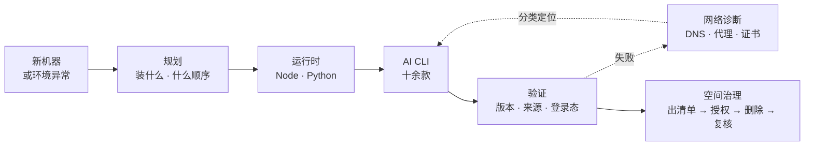

<div align="center">


# SOIA Open Env Skills

**AI 工具最会骗人的状态：命令能跑，但实际不能用**

16 个技能负责装好、验通、诊断清楚——只读诊断，破坏性操作必须你授权

[English](README.en.md) · 中文 · [全生态门户](https://github.com/soia-team/soia-open-skills)

<p align="center">
  
  
  
  
  
</p>

</div>

---

## 它解决什么

`node -v` 有输出不代表环境可用；应用文件存在不代表登录完成。新机器配 AI 环境每次踩的坑不一样，但**都栽在「以为装好了」这一步**。



## 16 个技能

### 01 规划与验证　`一台新机器 → 可用且验证过的 AI 环境`

| 技能 | 职责 | 开箱 |
|---|---|:-:|
| [`soia-env-environment-setup`](https://github.com/soia-team/soia-open-skills/blob/main/docs/skills/soia-env-environment-setup.md) | 从零规划并验证开发环境，协调所需的安装技能 | ✅ |
| [`soia-env-open-skills-install`](https://github.com/soia-team/soia-open-skills/blob/main/docs/skills/soia-env-open-skills-install.md) | 在三个宿主上安装或更新 SOIA 开源技能，支持全量、单插件与指定宿主 | ✅ |
| [`soia-env-ai-cli-upgrade`](https://github.com/soia-team/soia-open-skills/blob/main/docs/skills/soia-env-ai-cli-upgrade.md) | 审计并按授权升级多款 AI CLI，先预演再核验结果 | ✅ |
| [`soia-env-network-diagnose`](https://github.com/soia-team/soia-open-skills/blob/main/docs/skills/soia-env-network-diagnose.md) | 只读诊断 DNS、HTTPS、代理、证书与官方源，按固定七列汇报 | ✅ |
| [`soia-env-storage-cleanup`](https://github.com/soia-team/soia-open-skills/blob/main/docs/skills/soia-env-storage-cleanup.md) | 统计受管配置、状态、缓存占用，出清单；授权后才删，事后复核 | ✅ |

### 02 运行时　`空环境 → 可用的 Node 与 Python`

| 技能 | 职责 | 开箱 |
|---|---|:-:|
| [`soia-env-node-install`](https://github.com/soia-team/soia-open-skills/blob/main/docs/skills/soia-env-node-install.md) | 安装、验证或按授权更新 Node.js 与 npm | ✅ |
| [`soia-env-python-install`](https://github.com/soia-team/soia-open-skills/blob/main/docs/skills/soia-env-python-install.md) | 安装、验证或按授权更新 Python 与 pip | ✅ |

### 03 AI CLI　`命令不存在 → 装好、登录、版本核对完`

| 技能 | 职责 | 开箱 |
|---|---|:-:|
| [`soia-env-claude-cli-install`](https://github.com/soia-team/soia-open-skills/blob/main/docs/skills/soia-env-claude-cli-install.md) | Anthropic Claude Code CLI 的安装、登录与授权更新 | ✅ |
| [`soia-env-codex-install`](https://github.com/soia-team/soia-open-skills/blob/main/docs/skills/soia-env-codex-install.md) | OpenAI Codex CLI 的安装、验证与授权更新 | ✅ |
| [`soia-env-codex-setup-support`](https://github.com/soia-team/soia-open-skills/blob/main/docs/skills/soia-env-codex-setup-support.md) | 诊断 Codex 桌面版与 CLI 的安装、登录、性能与存储问题 | ✅ |
| [`soia-env-kimi-cli-install`](https://github.com/soia-team/soia-open-skills/blob/main/docs/skills/soia-env-kimi-cli-install.md) | Moonshot Kimi Code CLI；识别官方独立安装与 npm 两种来源 | ✅ |
| [`soia-env-opencode-cli-install`](https://github.com/soia-team/soia-open-skills/blob/main/docs/skills/soia-env-opencode-cli-install.md) | OpenCode CLI 的安装、登录与配置 | ✅ |
| [`soia-env-antigravity-cli-install`](https://github.com/soia-team/soia-open-skills/blob/main/docs/skills/soia-env-antigravity-cli-install.md) | Google Antigravity CLI（`agy`）安装、登录与从 Gemini CLI 迁移 | ✅ |
| [`soia-env-deepcode-cli-install`](https://github.com/soia-team/soia-open-skills/blob/main/docs/skills/soia-env-deepcode-cli-install.md) | 开源 Deep Code Agent CLI 的安装与配置 | ✅ |
| [`soia-env-qoder-cli-install`](https://github.com/soia-team/soia-open-skills/blob/main/docs/skills/soia-env-qoder-cli-install.md) | Qoder CLI；识别官方独立安装、Homebrew 与 npm 三种来源 | ✅ |

### 04 桌面客户端　`下载页 → 装好、签名验过、能启动`

| 技能 | 职责 | 开箱 |
|---|---|:-:|
| [`soia-env-workbuddy-install`](https://github.com/soia-team/soia-open-skills/blob/main/docs/skills/soia-env-workbuddy-install.md) | WorkBuddy 桌面端安装、签名验证与按授权更新 | ✅ |

✅ 全部 16 个技能装完即用，无需 API key。登录与系统授权由你在各官方界面完成

## 安装

三个宿主任选，装整个领域插件即 16 个技能一次到位。

```bash
claude plugin marketplace add soia-team/soia-open-skills && claude plugin install soia-env@soia
```

```bash
codex plugin marketplace add soia-team/soia-open-skills && codex plugin add soia-env@soia
```

WorkBuddy 是桌面端没有 CLI，由技能代劳——对 AI 说「装到 WorkBuddy」，或直接跑：

```bash
python3 <soia-open-skills>/skills/soia-meta-skill-release/scripts/install_workbuddy_experts.py soia-env
```

装完重启客户端，在【专家中心 → 我的专家】召唤 **Soia · 环境安装工程师**。

> **常驻成本 ~1.5k tok**。装完环境后可以 `claude plugin disable soia-env@soia` 收起来，下次配机器再开。
> 只想要单个技能可走 npx：`npx skills add soia-team/soia-open-env-skills -g -a '*' -s <技能名> -y`——与插件二选一，并存会产生双份索引且各自漂移。

## 不负责什么

- **不代你登录**。账号、验证码、系统安全提示由你在官方界面完成，技能不接手密码。
- **不代改凭据**。发现明文 API key 只报告位置并建议迁 Keychain 或环境变量。
- **清理必须先授权**。看过最新清单并明确同意后才删，绝不做未授权的全盘清理。
- **不装第三方移植包**。官方页面没有对应平台的下载入口时，如实报告「平台未验证」。
- **不把桌面应用当 npm 包**。WorkBuddy 这类客户端只走官方更新入口。

## 更多

| 想了解 | 去哪 |
|---|---|
| 首次配置为什么不等于安装完成、高频技能速览、仓库结构、三仓协作、权限与存储边界、官方来源 | [docs/operations.md](docs/operations.md) |
| 按机器用途选装哪些域 | [install-profiles.md](https://github.com/soia-team/soia-open-skills/blob/main/docs/install-profiles.md) |
| 整套生态怎么运转 | [学习指南](https://github.com/soia-team/soia-open-skills/blob/main/docs/learning-guide.md) |

## 贡献

改动技能后提交前跑：

```bash
python3 -m unittest discover -s tests -p 'test_*.py' && python3 scripts/audit_skills.py --strict && python3 scripts/generate_expert_manifest.py --check
```

完整流程见门户仓 [CONTRIBUTING.md](https://github.com/soia-team/soia-open-skills/blob/main/CONTRIBUTING.md)。

## License

MIT —— 见 [LICENSE](./LICENSE)。
